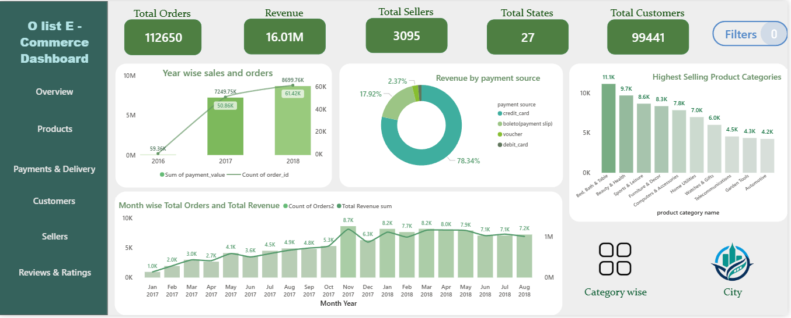
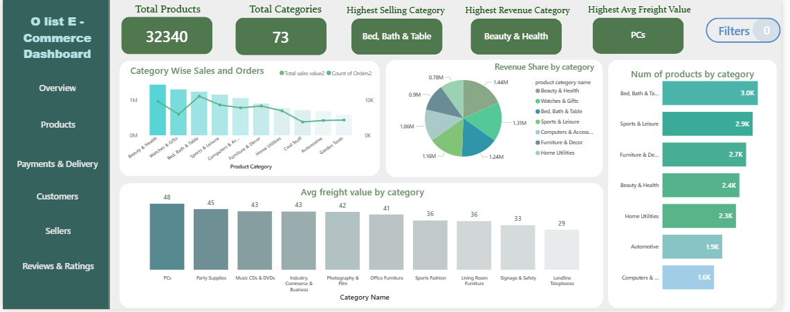
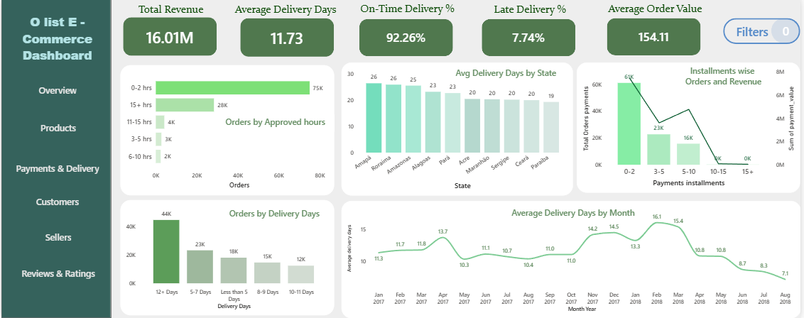
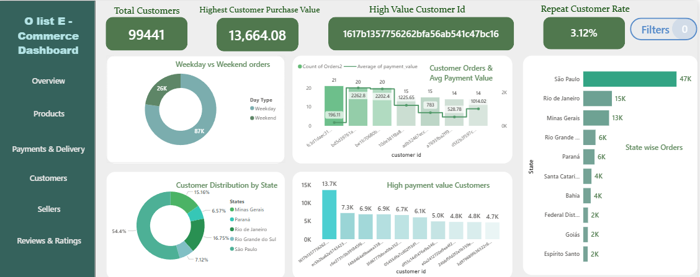
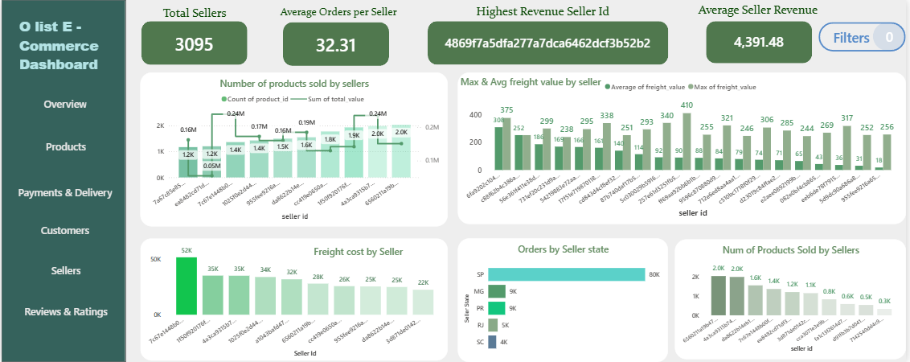
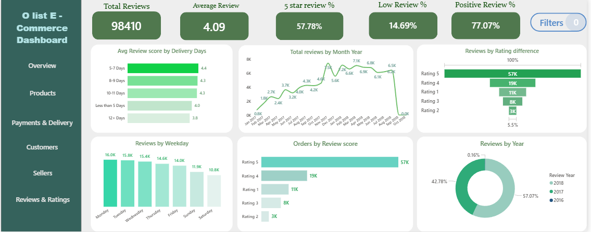
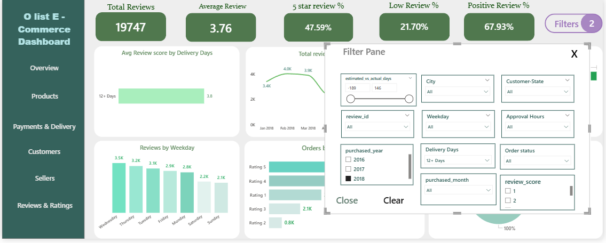
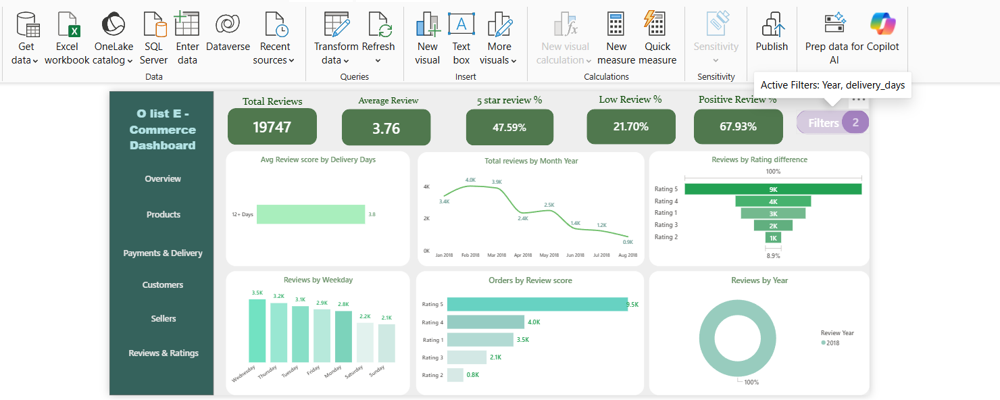

# Olist E-Commerce Analytics | End-to-End Data Analytics Project

> **From raw Brazilian e-commerce data to an interactive Power BI business intelligence solution**

An end-to-end **Data Analytics & Business Intelligence project** built using the **Brazilian E-Commerce Public Dataset by Olist**.

The project covers the complete analytics lifecycle — from raw CSV datasets and data cleaning to **EDA, feature engineering, PostgreSQL, SQL analysis, data modeling, DAX, interactive Power BI dashboards, business insights, and recommendations**.

The final solution analyzes **99,441 orders, 99,441 customers, 3,095 sellers, 32,340 products, and 73 product categories**, generating approximately **$16.1M in revenue**.

---

## Project Architecture

This project follows an **ETL + Database + Business Intelligence architecture**, where raw e-commerce data is transformed before being consumed by the reporting layer.

```text
Raw Olist CSVs
      │
      ▼
Python / Pandas
      │
      ├── Data Cleaning
      ├── Data Validation
      ├── EDA
      └── Feature Engineering
      │
      ▼
Cleaned & Integrated Dataset
      │
      ▼
PostgreSQL
      │
      ├── Data Storage
      └── SQL Business Analysis
      │
      ▼
Power BI
      │
      ├── Direct PostgreSQL Connection
      ├── Data Modeling
      ├── Snowflake-style Schema
      ├── 70 DAX Calculations
      ├── Calculated Columns
      ├── Interactive Filters & Bookmarks
      └── 6-Page Dashboard
      │
      ▼
Business Insights
      │
      ▼
Actionable Recommendations
```

### ETL & BI Approach

Rather than directly importing the raw Olist CSV files into Power BI, the data was first **cleaned, validated, explored, transformed, and feature-engineered using Python/Pandas**.

The processed data was then loaded into **PostgreSQL**, where SQL was used for additional analytical querying.

Power BI was subsequently connected **directly to the PostgreSQL database**, creating a more structured separation between:

**Data Preparation → Data Storage → Analytical Querying → Business Intelligence**

This architecture makes the project more representative of a practical analytics workflow where the BI layer consumes prepared data from a database rather than relying directly on raw source files.

---

## Project Overview

The objective of this project was to understand Olist's e-commerce business across multiple dimensions:

* Sales & revenue performance
* Product & category performance
* Customer behavior & retention
* Seller performance
* Payment behavior
* Delivery performance
* Customer reviews & satisfaction
* Geographic distribution
* Time-based trends

Rather than directly visualizing the raw datasets, I built an end-to-end analytical pipeline to **clean, transform, integrate, analyze, model, visualize, and interpret the data**.

---

## Tech Stack

| Stage                | Tools                        |
| -------------------- | ---------------------------- |
| Data Cleaning        | Python, Pandas               |
| EDA & Analysis       | Python, Pandas, Matplotlib   |
| Data Transformation  | Pandas / Feature Engineering |
| Database             | PostgreSQL, pgAdmin          |
| Querying             | SQL                          |
| Data Modeling        | Power BI                     |
| Calculations         | DAX                          |
| Visualization        | Power BI                     |
| Documentation        | GitHub                       |
| Large Dashboard File | Google Drive                 |

---

# End-to-End Workflow

```text
Raw Olist CSV Datasets
        ↓
Data Understanding & Validation
        ↓
Python / Pandas Cleaning
        ↓
Exploratory Data Analysis
        ↓
Feature Engineering
        ↓
Dataset Integration
        ↓
PostgreSQL Database
        ↓
SQL Business Analysis
        ↓
Power BI Data Modeling
        ↓
Snowflake-style Analytical Model
        ↓
DAX Measures & Calculated Columns
        ↓
Interactive 6-Page Dashboard
        ↓
Business Insights
        ↓
Actionable Recommendations
```

---

# 1️⃣ Dataset

The project uses the **Brazilian E-Commerce Public Datasets by Olist**, available through Kaggle.

The dataset contains approximately **100K orders from 2016–2018**, with information covering orders, customers, products, sellers, payments, freight, delivery, and customer reviews.

### Source

🔗 **Kaggle — Brazilian E-Commerce Public Datasets by Olist**

[View Datasets on Kaggle](https://www.kaggle.com/datasets/olistbr/brazilian-ecommerce)

The original dataset contains nine CSV files, including:

```text
olist_customers_dataset.csv
olist_geolocation_dataset.csv
olist_order_items_dataset.csv
olist_order_payments_dataset.csv
olist_order_reviews_dataset.csv
olist_orders_dataset.csv
olist_products_dataset.csv
olist_sellers_dataset.csv
product_category_name_translation.csv
```


---

# 2️⃣ Data Cleaning & Preparation — Python / Pandas

The raw datasets were first explored and cleaned using **Python and Pandas**.

### Major activities included:

* Inspecting dataset structure and data types
* Checking missing values
* Identifying duplicate records
* Investigating inconsistent identifiers
* Standardizing categorical fields
* Converting date/time columns into appropriate formats
* Handling missing and inconsistent values
* Validating relationships between datasets
* Mapping product categories
* Preparing datasets for integration

The cleaning process was designed to ensure that the data used for SQL and Power BI was consistent and analysis-ready.

---

# 3️⃣ Exploratory Data Analysis

After cleaning, EDA was performed using **Pandas and visualization techniques** to understand the underlying business patterns.

The analysis covered:

* Order trends
* Revenue trends
* Product categories
* Customer distribution
* Seller performance
* Payment methods
* Delivery performance
* Freight costs
* Review scores
* Geographic patterns
* Monthly and yearly trends

EDA was also used to identify potential data-quality issues and determine which derived features would be useful for downstream analysis.

---

# 4️⃣ Feature Engineering

One of the major parts of the project was creating **meaningful analytical features that were not directly available in the raw datasets**.

Examples include:

| Feature                      | Purpose                              |
| ---------------------------- | ------------------------------------ |
| `delivery_days`              | Measure actual delivery duration     |
| Approval duration            | Analyze time taken to approve orders |
| Estimated vs Actual Delivery | Identify delivery delays             |
| Year / Month / Weekday       | Time-series analysis                 |
| Review comment length        | Review behavior analysis             |
| Product category mapping     | Category-level analysis              |
| Delivery status indicators   | On-time vs late analysis             |
| Customer-related metrics     | Customer behavior analysis           |

These engineered columns enabled deeper analysis in both **SQL and Power BI**.

---

# 5️⃣ Dataset Integration

Multiple Olist datasets were integrated to create a consolidated analytical dataset.

The integration connected information across:

```text
Orders
   ↕
Customers
   ↕
Order Items
   ↕
Products
   ↕
Sellers
   ↕
Payments
   ↕
Reviews
```

A consolidated master dataset was created for downstream analytical work.

The final analytical dataset contained approximately **115K+ rows and 48 columns** after integration and feature engineering.

---

# 6️⃣ PostgreSQL & SQL Analysis

The cleaned and transformed data was loaded into **PostgreSQL** using pgAdmin.

SQL was then used to perform business-oriented analysis rather than relying only on Power BI visualizations.

### SQL techniques used

* `JOIN`
* `LEFT JOIN`
* `INNER JOIN`
* `GROUP BY`
* Aggregations
* `CASE WHEN`
* CTEs
* Subqueries
* Window functions
* Date/time functions
* Ranking
* Customer analysis
* Seller analysis
* Product analysis
* Delivery analysis
* Payment analysis
* Review analysis

### Business questions explored

* Which categories generate the most orders?
* Which categories generate the most revenue?
* Which sellers generate the highest revenue?
* Which sellers have the highest order volume?
* Which states generate the most orders?
* What payment methods are most popular?
* How long do orders take to reach customers?
* Which orders are delivered late?
* How does delivery performance vary over time?
* How does delivery duration relate to customer ratings?
* Who are the highest-value customers?

---

# 7️⃣ Power BI Data Modeling

The cleaned analytical data was brought into **Power BI** for business intelligence analysis.

A structured analytical model was created using a **snowflake-style data model**, separating transactional information from supporting dimensions where appropriate.

### Modeling considerations included:

* Relationships between orders and customers
* Orders and order items
* Products and categories
* Sellers
* Payments
* Reviews
* Date-based analysis
* Geographic analysis

The objective was to create a model that supported flexible filtering, aggregation, and cross-page analysis.

---

# 8️⃣ DAX & Analytical Calculations

A significant portion of the project involved creating custom **DAX measures and calculated columns**.

The dashboard contains **70 DAX measures/calculations**, covering KPIs, percentages, averages, rankings, customer metrics, seller metrics, delivery analysis, payment analysis, and review analysis.

### Examples of analytical measures

```text
Total Orders
Total Revenue
Unique Customers
Total Sellers
Total Products
Average Order Value
Average Delivery Days
On-Time Delivery %
Late Delivery %
Repeat Customer Rate
Average Review Score
Revenue by Category
Order Share %
Customer Distribution %
Seller Revenue
Average Seller Revenue
Payment Installment Analysis
Review Distribution
Delivery Performance
Time-Based Metrics
Ranking Metrics
```

The DAX layer allowed the dashboard to go beyond simple aggregation and provide **dynamic business metrics that respond to user selections and filters**.

---

# 9️⃣ Power BI Dashboard

The final Power BI solution consists of **6 interactive pages**.

### 01 — Overview

Provides an executive-level summary of:

* Total Orders
* Revenue
* Customers
* Sellers
* Yearly performance
* Monthly trends
* Payment distribution
* Category performance
* Geographic order distribution

---

### 02 — Products

Analyzes:

* Total products
* Product categories
* Orders by category
* Revenue by category
* Product assortment
* Average freight value
* Category-level performance

---

### 03 — Payments & Delivery

Analyzes:

* Payment methods
* Installments
* Revenue by payment type
* Average delivery days
* On-time delivery %
* Late delivery %
* Delivery duration distribution
* Delivery performance by state
* Monthly delivery trends

---

### 04 — Customers & Geography

Analyzes:

* Total customers
* Unique customers
* Customer distribution
* Orders by customer location
* State-level customer concentration
* Customer order frequency
* Average payment value
* High-value customers
* Weekday vs weekend ordering behavior

---

### 05 — Sellers

Analyzes:

* Total sellers
* Average orders per seller
* Seller revenue
* Seller order volume
* Products sold by seller
* Freight cost by seller
* Average freight value
* Seller state distribution

---

### 06 — Reviews

Analyzes:

* Total reviews
* Average review score
* Rating distribution
* Positive vs lower-rated reviews
* Reviews by month
* Reviews by year
* Reviews by weekday
* Review score by delivery duration
* Relationship between delivery experience and customer satisfaction

---

# Interactive Dashboard Features

The Power BI dashboard includes:

* Dynamic filter pane
* Cross-filtering
* Interactive visual interactions
* Page navigation
* Bookmarks
* KPI cards
* Dynamic charts
* Drill/filter-based exploration
* Consistent dashboard design
* Multi-page navigation
* Business-focused visual hierarchy

The dashboard was designed to make the analysis **interactive and easy to explore rather than presenting static charts**.

---

# Key Business Insights

The analysis produced several important findings:

| #  | Insight                                                                                                                                                |
| -- | ------------------------------------------------------------------------------------------------------------------------------------------------------ |
| 1  | Olist generated approximately **$16.1M revenue across 99K+ orders**.                                                                                   |
| 2  | Sales and order activity increased significantly after 2016, with **2018 recorded the highest overall sales and order activity within the available dataset period.** in the analysis.                          |
| 3  | **Bed Bath & Table** generated the highest order volume, while **Beauty & Health** generated the highest category revenue.                             |
| 4  | **Credit cards accounted for ~78.34%** of payment usage, making them the dominant payment method.                                                      |
| 5  | Overall on-time delivery was approximately **92.26%**, while **7.74%** of orders were late.                                                            |
| 6  | A substantial number of orders took **more than 12 days to deliver**, highlighting potential logistics improvement opportunities.                      |
| 7  | The repeat-customer rate was approximately **3.12%**, indicating a significant customer-retention opportunity.                                         |
| 8  | Customer and order activity was highly concentrated in **São Paulo**, making geography an important dimension for business analysis.                   |
| 9  | Seller performance varied substantially across revenue, order volume, product volume, and freight cost.                                                |
| 10 | Delivery duration showed an association with customer review scores, indicating that logistics performance is an important customer-experience metric. |

---

# 💡 Business Recommendations

Based on the analysis, the following areas could be investigated:

###  1. Improve Delivery Performance

Investigate orders with extended delivery times by examining seller processing, logistics partners, geography, and delivery bottlenecks.

###  2. Improve Customer Retention

The low repeat-customer rate creates an opportunity for targeted re-engagement, loyalty initiatives, and personalized offers.

###  3. Identify High-Value Customers

Use **RFM-style segmentation** to distinguish high-value, frequent, one-time, and potentially at-risk customers.

###  4. Optimize High-Revenue Categories

Prioritize high-revenue categories for inventory, seller acquisition, promotions, and cross-selling analysis.

###  5. Monitor Seller Performance

Evaluate sellers using a combination of revenue, order volume, freight cost, delivery performance, and review scores.

###  6. Investigate Low Ratings

Analyze lower-rated reviews alongside seller, product, delivery, and geographic information to identify recurring problems.

###  7. Analyze Geographic Concentration

Use state and city-level demand patterns to support logistics and marketplace expansion decisions.

###  8. Monitor Payment Behavior

Continue monitoring payment-method and installment trends to understand customer purchasing behavior.

###  9. Optimize Product Assortment

Compare product availability against actual order volume and revenue to identify categories with high demand or underperforming inventory.

###  10. Build Continuous KPI Monitoring

Use the Power BI model as a foundation for ongoing monitoring of revenue, customers, sellers, delivery performance, and customer satisfaction.

---

#  Dashboard Preview

### Overview



### Products

)

### Payments & Delivery

)

### Customers

)

### Sellers

)

### Reviews

)

### Interactive Filtering

#### Filter Pane

)

#### Filter Details on Hover

)


---

# Project Structure

```text
Olist-Ecommerce-Analytics/
│
├── data/
│   ├── merged/
│   └── eda/
│
├── notebooks/
│   ├── olist_customers.ipynb
│   ├── olist_order_reviews.ipynb
│   ├── olist_ordersnew.ipynb
│   ├── olist_payments.ipynb
│   ├── olist_products.ipynb
│   ├── olist_order_items.ipynb
│   ├── olist_order_items3.ipynb
│   └── Postgresql_loading.ipynb
│
├── sql/
│   ├── Olist_SQL_Queries.sql
│
├── powerbi/
│   └── olist-performance-Dashboard.pbix
│
├── images/
│   ├── overview.png
│   ├── products.png
│   ├── payments_delivery.png
│   ├── customers.png
│   ├── sellers.png
│   ├── reviews.png
│   ├── filter_pane.png
│   └── filter_hover.png
|
|── data model/
│   └── data model screenshot.png
|
└── README.md
```

---

#  Download the Complete Power BI Dashboard

### 🔗 Power BI Dashboard & Project Files

**Powerbi-Olist-Dashboard:**
`[Powerbi/olist-performance-Dashboard.pbix]`

---

# 🎯 Project Outcome

This project demonstrates an end-to-end approach to data analytics:

> **Collect → Clean → Explore → Engineer → Integrate → Store → Query → Model → Calculate → Visualize → Analyze → Recommend**

The key objective was not simply to create a visually appealing dashboard, but to demonstrate the complete process of transforming **raw, multi-table transactional data into a structured business intelligence solution**.

###  Skills Demonstrated

`Python` `Pandas` `EDA` `Feature Engineering` `PostgreSQL` `SQL` `Power BI` `DAX` `Data Modeling` `Snowflake-style Data Model` `Business Intelligence` `Data Visualization` `Business Analysis`

---

## ⭐ If you find this project useful

Feel free to explore the notebooks, SQL analysis, dashboard screenshots, and Power BI report.

**Built as part of my Data Analytics portfolio to demonstrate practical end-to-end analytics and Business Intelligence skills.**
